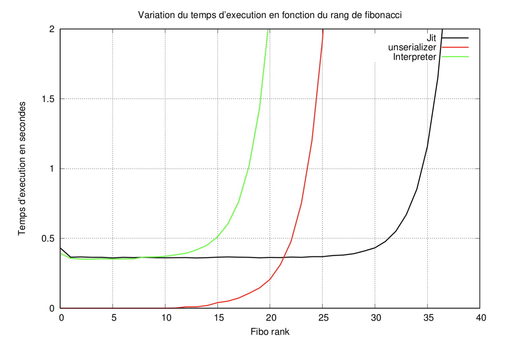

Thomas Campistron ([@irevoire](https://github.com/irevoire))</br>
Sophie Kaleba (owner of the repo)</br>


Naive js JIT compiler developped together with @irevoire in a course at [Lille1](http://fil.univ-lille1.fr/) given by [Gilles Grimaud](http://www.lifl.fr/~grimaud/) and [Samuel Hym](http://www.lifl.fr/~hym/).
Will undergo some heavy refactoring in the future

# USAGE

In order to do anything with this Jit / Interpreter you'll need to parse your file.

Because this project was a college project at first we didn't code our own lexer / parser and used the one provided in our course : __jsp__

```
git clone http://www.fil.univ-lille1.fr/~hym/d/jsp.git
```

# The end of the courses

Our purpose in the course was only to compile a *bad* fibonacci functions like that ;

```js
def fibo(n) {
	if (n < 2)
		return 1;
	return fibo(n - 2) + fibo(n - 1);
}
```

To do a kind of *shitty* bench.

## Implementation

We did it in ruby because it seemed like a fun language to learn (and our teacher gived us a skeleton code in java, which is, I'm sure, not a fun language).

What we've done ;
* Only compute 64 bits integers
* Can define function
* A lot of BinaryOperation are implemented (+, \*, -, /, <, =, <=, >, >=, ...)
* If (without else) is implemented
* While is implemented
* Only compute function with less than 6 parameters

At this point we do not really do a Jit, we compile everything and then execute everything without any phase of interpretation.

## Result

At the end we wanted to measure the execution time of fibonacci in our Jit vs our Interpreter.

Another group of the courses gave us their project, they did a C interpreter with a lot of optimization, their goal was to be as fast as possible.



* The Jit is our project
* The Uneserializer is the C Interpreter
* The Interpreter is our ruby Interpreter (which has no optimization at all)

## Conclusion

Our Interpreter is so bad at the start that we had no reason to start interpreting thing and then move to the Jit.
But in the end, as we expected, the Jit is way more powerful than the two interpreter.


# After the courses

We then watched why we were so slow on startup using [ruby-prof](https://github.com/ruby-prof/ruby-prof) and [qcachegrind](https://github.com/KDE/kcachegrind) :


As most of the time was lost in "require\_relative" function (which is the function you use when you use multiple file in ruby), we decided to move on another language.


And as we both wanted to learn cpp we started to recode everything in cpp.


